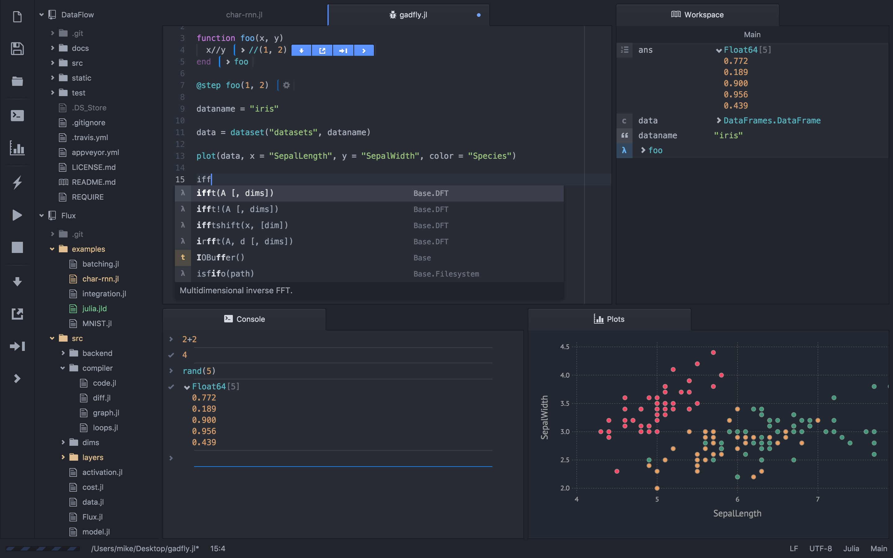
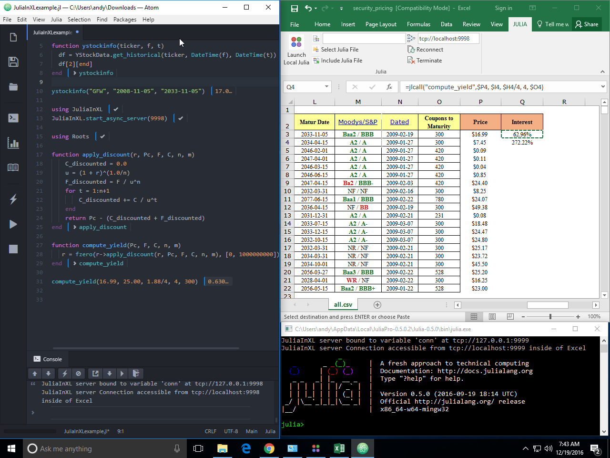
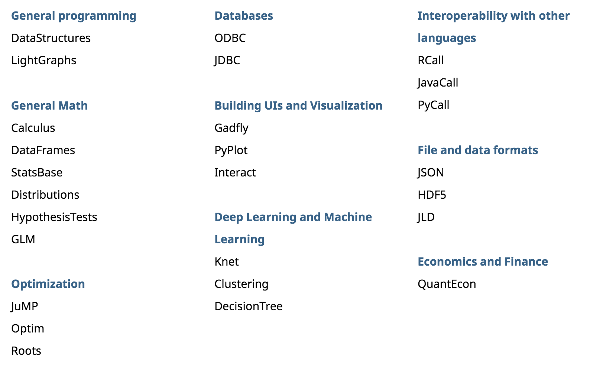

# Julia

### Notes from the front lines

MassMutual Data Science Seminar

April 2018

by Andy Reagan

---

## Disclaimer

This is mostly my opinion.

Note: The rest is the opinion of others.

---


### Julia project goals
### (why is this language around)

- built by hackers
- speed: less clunkly + faster than R, faster than MATLAB
- dynamic: run and test code in realtime

---

# Workflow

Writes like R/MATLAB, code it like Python

- JUNO IDE (bundled into JuliaPro)
- Remote kernel hydrogen
    - Like any other kernel
- Jupyter notebook/lab (same)
- REPL (like IPython, R console)
- Spark.jl (think: PySpark or RSpark)
    - https://github.com/dfdx/Spark.jl

----

## JuliaPro IDE

Feel at home coming from RStudio/MATLAB IDEs.

Note: It's juno running on Atom

----



----

## It runs in Excel...



----

### Getting up and running

Download binary from here: https://julialang.org/downloads/

---

## Core packages



---

## Fun/boring* stuff

- data type system (typing optional) <!-- .element: class="fragment" data-fragment-index="1" -->
- JIT compilation <!-- .element: class="fragment" data-fragment-index="2" -->
- next to assembly <!-- .element: class="fragment" data-fragment-index="3" -->
- multiple dispatch <!-- .element: class="fragment" data-fragment-index="4" -->
- homoiconicity <!-- .element: class="fragment" data-fragment-index="5" -->
- *only depends on perspective <!-- .element: class="fragment" data-fragment-index="6" -->

Note:
- Type inference
- LLVM for JIT
- Core of julia is written in julia
- Functional, functional

----

## Data types

What you might expect...
- Functions
- Strings (unicode)
- Numbers
- Arrays
- Matrices
- Sparse versions

Define your own!

----

Some choices: Int8, UInt8, Int16, UInt16, Int32, UInt32, Int64, UInt64, Int128, UInt128, Float16, Float32, and Float64

```julia
local x::Int8  # in a local declaration
x::Int8 = 10   # as the left-hand side of an assignment
```

----

```julia
abstract type Number end
abstract type Real     <: Number end
abstract type AbstractFloat <: Real end
abstract type Integer  <: Real end
abstract type Signed   <: Integer end
abstract type Unsigned <: Integer end
```

----

## Roll you own

```julia
julia> struct Foo
           bar
           baz::Int
           qux::Float64
       end
```

```julia
julia> foo = Foo("Hello, world.", 23, 1.5)
Foo("Hello, world.", 23, 1.5)

julia> typeof(foo)
Foo
```

Note: this is how Date and DateTime work...

<!-- ----

## Compilation -->

----

## Assembly

https://docs.julialang.org/en/stable/stdlib/base/#Base.code_native

```assembly
julia> code_native(+,(Int64,Int64))
	.section	__TEXT,__text,regular,pure_instructions
Filename: int.jl
	pushq	%rbp
	movq	%rsp, %rbp
Source line: 32
	leaq	(%rdi,%rsi), %rax
	popq	%rbp
	retq
Source line: 32
	nopw	(%rax,%rax)
```

----

```assembly
julia> code_native(/,(Int64,Int64))
	.section	__TEXT,__text,regular,pure_instructions
Filename: int.jl
	pushq	%rbp
	movq	%rsp, %rbp
Source line: 38
	xorps	%xmm0, %xmm0
	cvtsi2sdq	%rdi, %xmm0
	xorps	%xmm1, %xmm1
	cvtsi2sdq	%rsi, %xmm1
	divsd	%xmm1, %xmm0
	popq	%rbp
	retq
Source line: 38
	nopw	(%rax,%rax)
```

----

## Parallelization

```julia
a = SharedArray{Float64}(10)
@parallel for i = 1:10
    a[i] = i
end
```

----

## Multiple dispatch

Functions have multiple methods depending upon args.

```assembly
julia> code_native(+,(Char,Int64))
	.section	__TEXT,__text,regular,pure_instructions
Filename: char.jl
	pushq	%rbp
	movq	%rsp, %rbp
Source line: 40
	testl	%edi, %edi
	js	L24
	movslq	%esi, %rax
	cmpq	%rsi, %rax
	jne	L39
Source line: 4
	addl	%edi, %esi
	js	L54
Source line: 40
	movl	%esi, %eax
	popq	%rbp
	retq
L24:
	movq	28899257(%rip), %rax
	movq	(%rax), %rdi
	callq	"jlcall__setint!_35260"
L39:
	movq	28899242(%rip), %rax
	movq	(%rax), %rdi
	callq	"jlcall__setint!_35260"
Source line: 4
L54:
	movq	28899227(%rip), %rax
	movq	(%rax), %rdi
	callq	"jlcall__setint!_35260"
Source line: 4
	nopw	%cs:(%rax,%rax)
```

---

## Package management

So, so cool. Whiteboard!

---

## Metaprogramming

Rejoice, this is how it should work!

> Every Julia program starts life as a string.

```julia
julia> prog = "1 + 1"
"1 + 1"
```

```julia
julia> ex1 = parse(prog)
:(1 + 1)

julia> typeof(ex1)
Expr
```
----

```julia
julia> ex1.args
3-element Array{Any,1}:
  :+
 1
 1
```

```julia
julia> ex2 = Expr(:call, :+, 1, 1)
:(1 + 1)
```

```julia
julia> ex1 == ex2
true
```
----

## Quoting

```julia
julia>      :(a + b*c + 1)  ==
       parse("a + b*c + 1") ==
       Expr(:call, :+, :a, Expr(:call, :*, :b, :c), 1)
true
```
----

## Finally, eval

```julia
julia> prog = "1 + 1"
"1 + 1"

julia> parse(ans)
:(1 + 1)

julia> eval(ans)
2

julia> typeof(eval(ans))
Int64

julia> typeof(eval(:(1+1)))
Int64
```

---

# That was fun!

---

## DS with Julia

Ingredients:

- Data
- Model fitting


----

## DataFrames.jl

```julia
julia> data = DataFrame(X=[1,2,3], Y=[2,4,7])
3x2 DataFrame
|-------|---|---|
| Row # | X | Y |
| 1     | 1 | 2 |
| 2     | 2 | 4 |
| 3     | 3 | 7 |
```

----

```julia
julia> using DataFrames, CSV

julia> iris = CSV.read(joinpath(Pkg.dir("DataFrames"), "test/data/iris.csv"));

julia> head(iris)
6×5 DataFrames.DataFrame
│ Row │ SepalLength │ SepalWidth │ PetalLength │ PetalWidth │ Species │
├─────┼─────────────┼────────────┼─────────────┼────────────┼─────────┤
│ 1   │ 5.1         │ 3.5        │ 1.4         │ 0.2        │ setosa  │
│ 2   │ 4.9         │ 3.0        │ 1.4         │ 0.2        │ setosa  │
│ 3   │ 4.7         │ 3.2        │ 1.3         │ 0.2        │ setosa  │
│ 4   │ 4.6         │ 3.1        │ 1.5         │ 0.2        │ setosa  │
│ 5   │ 5.0         │ 3.6        │ 1.4         │ 0.2        │ setosa  │
│ 6   │ 5.4         │ 3.9        │ 1.7         │ 0.4        │ setosa  │
```

----

```julia
julia> using RDatasets

julia> form = dataset("datasets", "Formaldehyde")
6x2 DataFrame
|-------|------|--------|
| Row # | Carb | OptDen |
| 1     | 0.1  | 0.086  |
| 2     | 0.3  | 0.269  |
| 3     | 0.5  | 0.446  |
| 4     | 0.6  | 0.538  |
| 5     | 0.7  | 0.626  |
| 6     | 0.9  | 0.782  |
```

Also, `read_rda` function to read directly.

----

### Functionality

- `size()`, `head()`, `tail()`
- `nrow()`, `ncol()`, `length()`
- `describe()`
- `showcols()`
- `names()`, `eltypes()`, `names!()`
- `Missing`
- `merge!()`, `hcat()`, `insert!()`...
- `map`, `groupby`
- etc...

----

## Modeling

- GLM: GLM.jl
- MixedModels: MixedModels.jl
- Decision Trees: DecisionTree.jl (yes, boosting too)
- Deep Learning: Knet, Flux, Mocha

Quick example next.


----

```julia
julia> OLS = glm(@formula(Y ~ X), data, Normal(), IdentityLink())
DataFrameRegressionModel{GeneralizedLinearModel,Float64}:

Coefficients:
              Estimate Std.Error  z value Pr(>|z|)
(Intercept)  -0.666667   0.62361 -1.06904   0.2850
X                  2.5  0.288675  8.66025   <1e-17

julia> stderr(OLS)
2-element Array{Float64,1}:
 0.62361
 0.288675

julia> predict(OLS)
3-element Array{Float64,1}:
 1.83333
 4.33333
 6.83333
```

---

## Major weaknesses

Weak spot for me: dataframes.jl clunkier than Pandas, much clunkier than dplyr...

---

## Takeaway

Just so much fun.

Not a primary language for data manipulation/exploration for me, but can build models fast!

---

## Resources

<ul>
    <li><p><a href="http://math.mit.edu/~stevenj/Julia-cheatsheet.pdf">Julia and IJulia cheatsheet</a></p></li>
    <li><p><a href="https://learnxinyminutes.com/docs/julia/">Learn Julia in a few minutes</a></p></li>
    <li><p><a href="https://github.com/chrisvoncsefalvay/learn-julia-the-hard-way">Learn Julia the Hard Way</a></p></li>
    <li><p><a href="http://samuelcolvin.github.io/JuliaByExample/">Julia by Example</a></p></li>
    <li><p><a href="https://github.com/dpsanders/hands_on_julia">Hands-on Julia</a></p></li>
</ul>

----

## Resources (cont'd)
<ul>
    <li><p><a href="http://homerreid.dyndns.org/teaching/18.330/JuliaProgramming.shtml">Tutorial for Homer Reid's numerical analysis class</a></p></li>
    <li><p><a href="https://raw.githubusercontent.com/ViralBShah/julia-presentations/master/Fifth-Elephant-2013/Fifth-Elephant-2013.pdf">An introductory presentation</a></p></li>
    <li><p><a href="https://julialang.org/blog/2013/03/julia-tutorial-MIT">Videos from the Julia tutorial at MIT</a></p></li>
    <li><p><a href="https://www.youtube.com/user/JuliaLanguage/playlists">YouTube videos from the JuliaCons</a></p></li>
</ul>

---

# Questions?

Give it a try!

----

```julia
function mixed_formula(fixeff, raneff, group=:agent_cluster)
    # println(fixeff)
    # println(raneff)
    full_formula = []
    append!(full_formula, fixeff)
    # println(full_formula)
    push!(full_formula, parse("(1|$(group))"))
    # println(full_formula)
    # mixedeffects will still fit the intercept (as if we had 1+var) without the 1+
    # perhaps this is because we used the intercept above...
    append!(full_formula, [parse("($(var)|$(group))") for var in raneff])
    # println(full_formula)
    glmm_formula = StatsModels.Formula(:sale_label, Expr(:call, :+, full_formula))
    println(glmm_formula)
    glmm_formula
end
```

----

I wrote a package a long time ago...

https://github.com/JuliaLang/METADATA.jl/tree/metadata-v2/OpenFOAM/versions/0.0.1

https://github.com/andyreagan/OpenFOAM.jl

----

Boundary stuff with Julia

[Knet](https://github.com/denizyuret/Knet.jl)

[Flux](http://fluxml.ai/)

[CUDAnative](http://juliagpu.github.io/CUDAnative.jl/stable/man/usage.html)

[DataFlow](https://github.com/MikeInnes/DataFlow.jl)

[JuliaDiff](http://www.juliadiff.org/)
